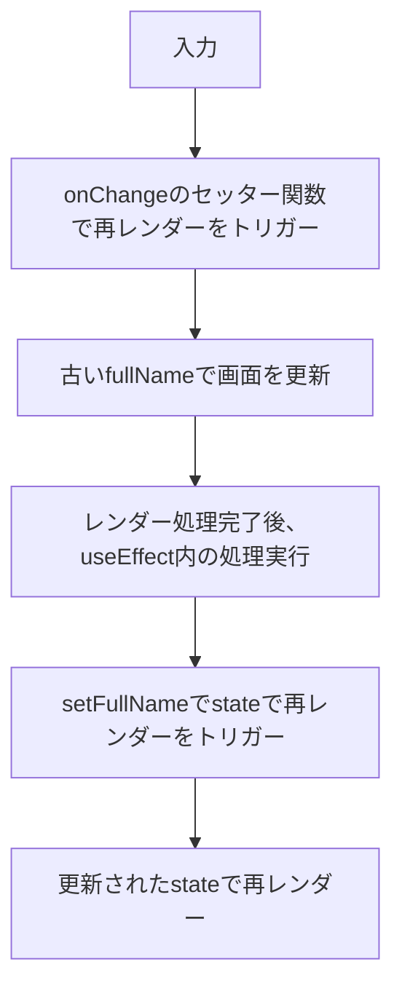

```mermaid
graph TD
    A[入力] --> B[onChangeのセッター関数で再レンダーをトリガー]
    B --> C[古いfullNameで画面を更新]
    C --> D[レンダー処理完了後、useEffect内の処理実行]
    D --> E[setFullNameでstateで再レンダーをトリガー]
    E --> F[更新されたstateで再レンダー]
```
